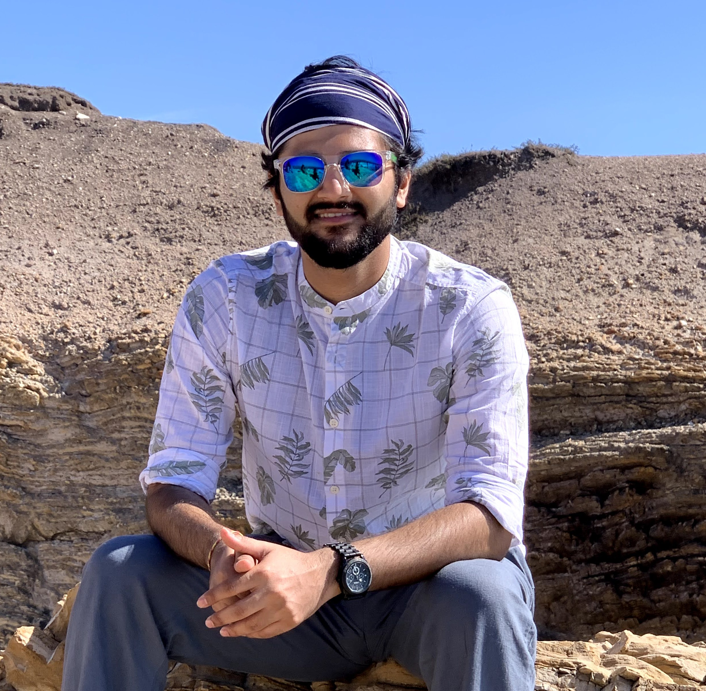

# About

I'm a Graduate student at [University of Southern California](https://www.usc.edu/) (USC) majoring in Electrical and Computer Engineering with specialization in Data Science. My research interest lies in application of Computer Vision in Autonomous Driving. I'm working as Computer Vision Summer Intern at [Frenzy Labs](https://frenzy.ai/) and as a Graduate Researcher at [USC Cyber-Physical Systems - VIDA](https://cps-vida.github.io/) group. 

I'm currently working on projects involving, 

- RESTful request dispatching using Flask framework to integrate object detection and classification network. 
- Semantic Segmentation on Berkeley Deep Drive Dataset using DeepLabv3+ segmentation algorithm. 
- Incorporate Signal Temporal (STL) monitoring, and vision based Timed Quality Temporal (TQTL) monitoringalgorithms for ROS to spot perception robustness. 

Before this, I received my B.S. in Instrumentation and Control Engineering at the Institute of Technology, Nirma University in 2015 and was working with Reliance Industries Ltd. till 2018 as Technical Manager. 


# Experience 

### 1. Computer Vision Intern (Frenzy Labs, Inc.)

Member of Machine Learning team focusing on optimzing the state-of-the-art backbone HCNN network to falicitate better predicitions, thus providing the user an inexplicable apparel experience. 

Responsibilites include, 
- Optimize the state-of-the-art backbone H-CNN and R-CNN network for apparel localization and classification from an image, smart labeling, and product search from photograph and content. 
- Develop a RESTful request dispatching using Flask framework to integrate object detection and classification network to boost detection performance and reducing search time to seconds. 


### 2. Graduate Researcher (USC CPS - VIDA group) 

I'm working with Prof. Jyotirmoy Deshmukh on developing monitoring algorithms for data streams that are generated by perception algorithms to be tested in a F1-10th autonomous vehicle. 

- Built the F1-10th autonomous vehicle for outdoor envirnment capable of localizing in a specific environment. 
    - Sensors
        - ZED 3D camera 
        - Hokoyu LiDAR 
        - Vecternav IMU 
    
    - System on Chip (SoC)
        - Jetson Xavier 
    - Software 
        - Object detection using Yolov3 capable of detecting road objects. 
        - Semantic Segmentation using DeepLabV3+ (under progress) 
        - Google's Cartographer SLAM 
        - ROS Navigation for autonomous navigation 
        - Road Object tracking using Deep Learning method. 
    - Stack - C/C++, ROS, Python, Matlab, PCL, Jetson Xavier  

- Develop the software stack to falicitate the testing of Signal Temporal (STL) monitoring, and vision-based Timed Quality Temporal (TQTL) monitoring algorithms for ROS to detect perception robustness. 

# Projects 

## - On-going 

1. Semantic Segmentation of road objects using DeepLabv3+ network architecture. 
Dataset - [Berkeley Deep Drive](https://bdd-data.berkeley.edu/)
    - 10,000 diverse images with pixel-level and rich instance-level annotations. 
Stack - Python, DeepLabv3+, Jetson Xavier

2. 2D Object Tracking using DeepSort algorithm for ROS. 
    - Developing tracking algorithm to falicitate testing of Perception robustness using TQTL monitors. 

3. Develop STL and TQTL monitors for testing software robustness. 
    - Give some details 


## Completed 

1. 2D Road Object Detection using Yolov3 
2. Traffic Light Detection using Yolov3 
3. IDEAS - Intelligent Driver Enhanced Assistant System 
4. Image Processing Algorithms 
5. Sentiment Analysis of User Reviews 
6. CNN based Distracted Driver Detection 
7. CNN based CIFAR-10 Image Classification 
8. RRT Robot Motion Planner
9. Road Vehicle and Lane Line detection 
10. State Estimation using Kalman Fiter 


 

<!--  -->

<!-- You can use the [editor on GitHub](https://github.com/yogeshgajjar/yogeshgajjar.github.io/edit/master/README.md) to maintain and preview the content for your website in Markdown files.

Whenever you commit to this repository, GitHub Pages will run [Jekyll](https://jekyllrb.com/) to rebuild the pages in your site, from the content in your Markdown files.

### Markdown

Markdown is a lightweight and easy-to-use syntax for styling your writing. It includes conventions for

```markdown
Syntax highlighted code block

# Header 1
## Header 2
### Header 3

- Bulleted
- List

1. Numbered
2. List

**Bold** and _Italic_ and `Code` text

[Link](url) and 
```

For more details see [GitHub Flavored Markdown](https://guides.github.com/features/mastering-markdown/).

### Jekyll Themes

Your Pages site will use the layout and styles from the Jekyll theme you have selected in your [repository settings](https://github.com/yogeshgajjar/yogeshgajjar.github.io/settings). The name of this theme is saved in the Jekyll `_config.yml` configuration file.

### Support or Contact

Having trouble with Pages? Check out our [documentation](https://docs.github.com/categories/github-pages-basics/) or [contact support](https://github.com/contact) and we’ll help you sort it out. -->
